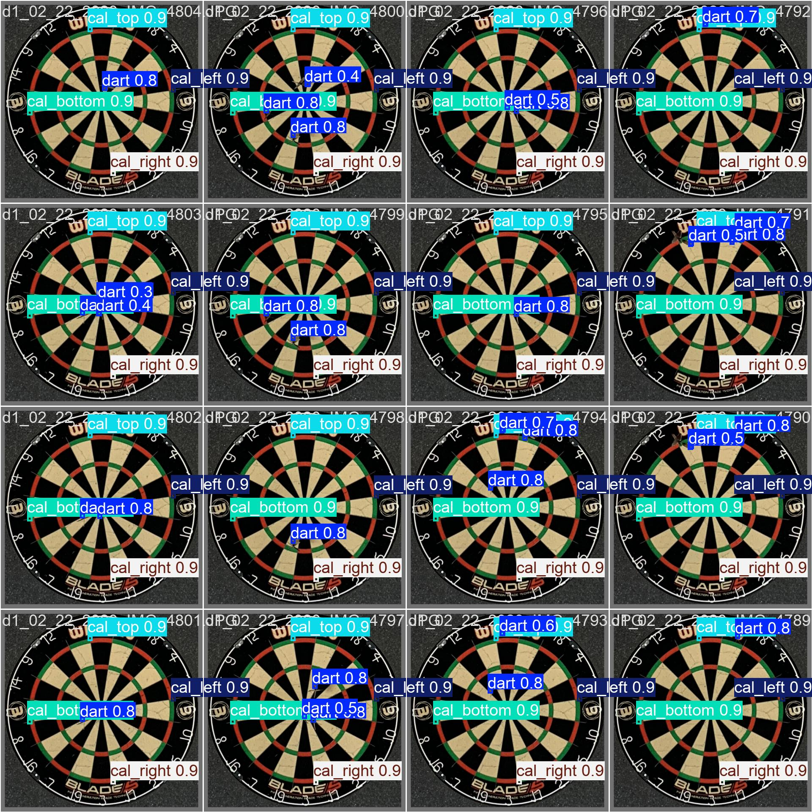
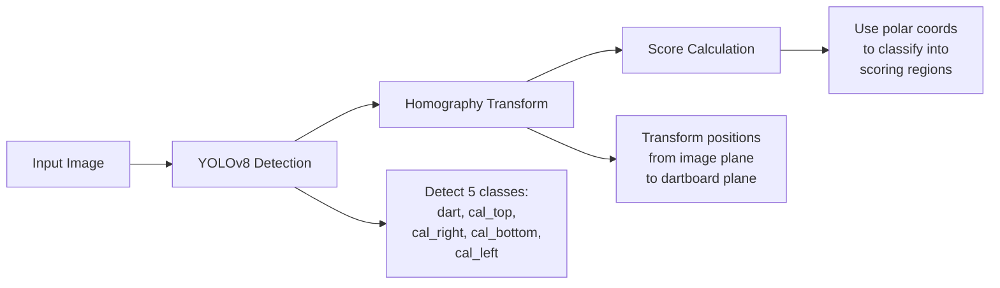
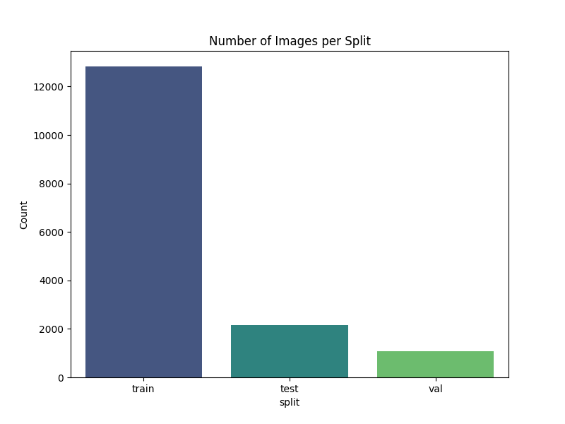
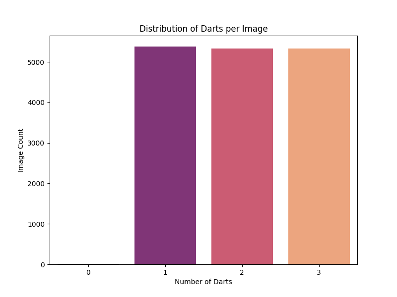
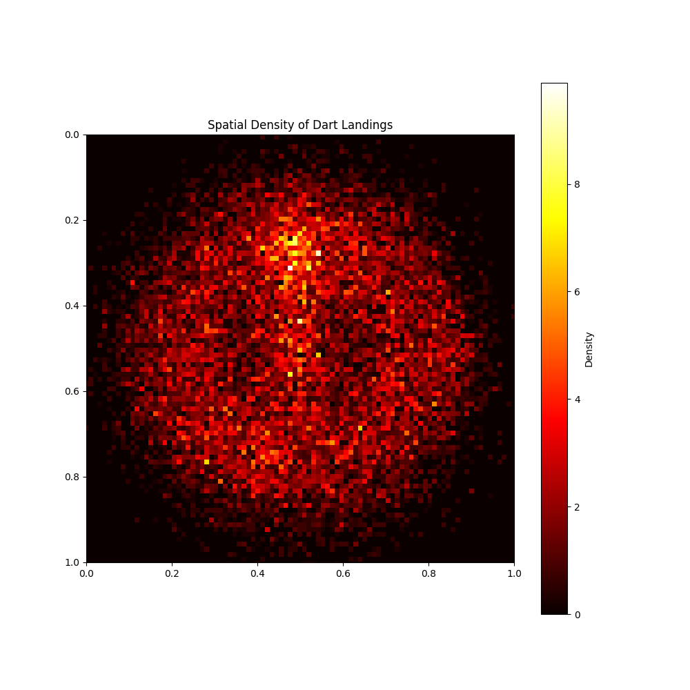
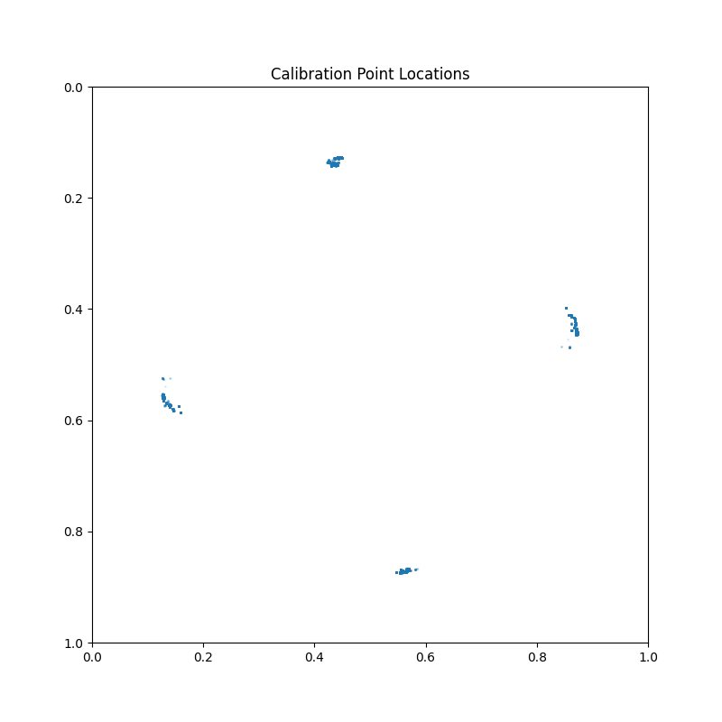
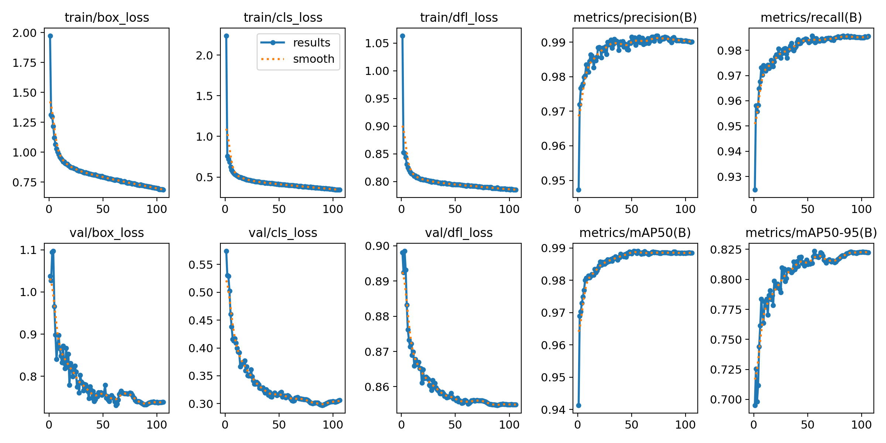
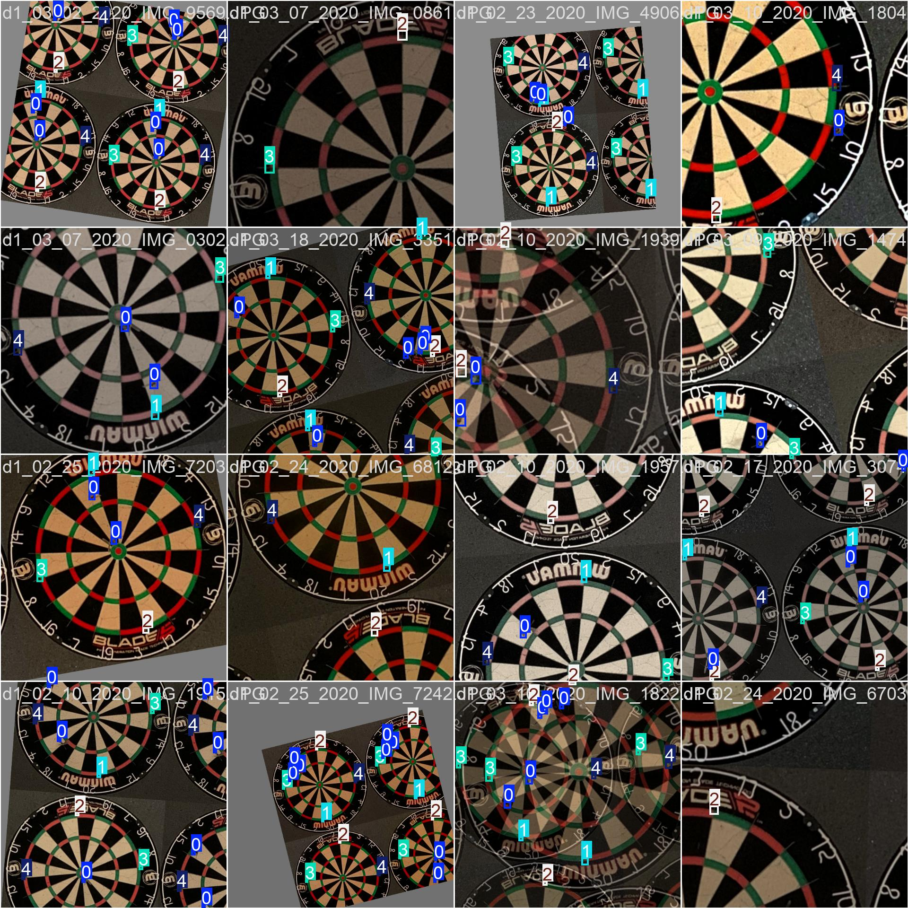
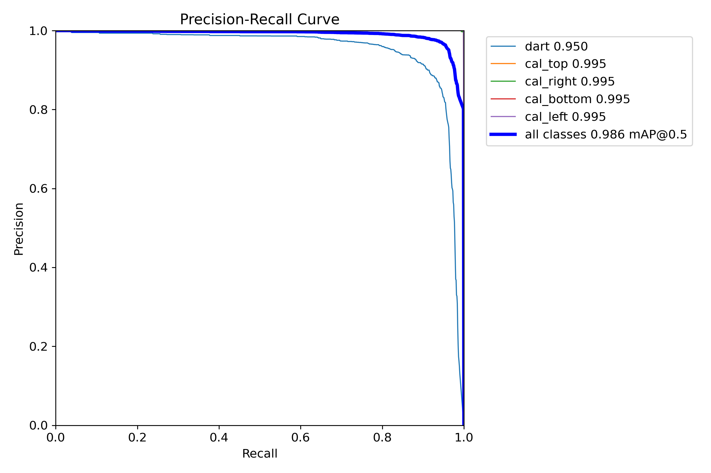
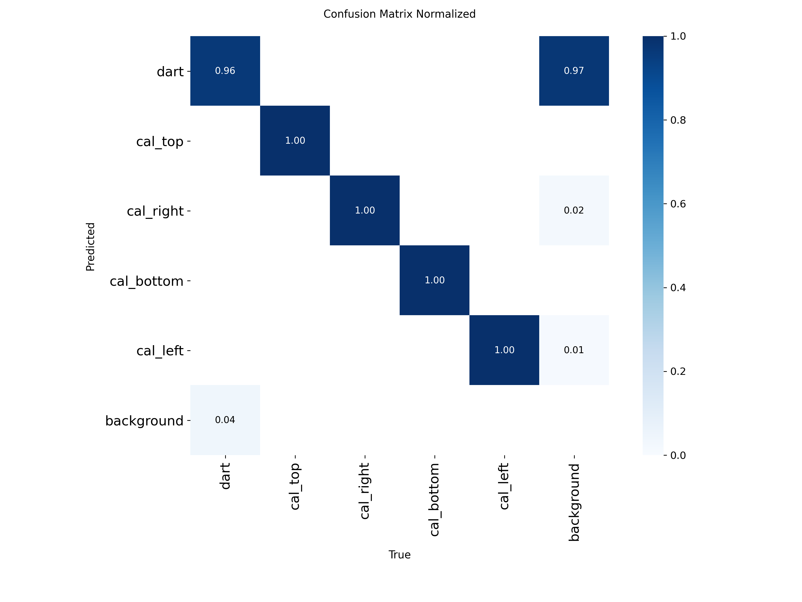

# DartsVision

<div align="center">




**Automatic dart scoring using computer vision and deep learning.**

Point a camera at your dartboard, and let AI figure out where the darts landed.

</div>

---

## Table of Contents

- [Overview](#-overview)
- [How It Works](#-how-it-works)
- [Dataset Analysis](#-dataset-analysis)
- [Model Training](#-model-training)
- [Results](#-results)
- [Installation & Usage](#-installation--usage)
- [Acknowledgments](#-acknowledgments)

---

## Overview

DartsVision is a deep learning-based system for **automatic dart scoring from single images**. Instead of expensive multi-camera setups, this system uses just one camera (even a smartphone) to detect where darts landed and calculate scores automatically.

### The Problem

- **Manual scoring is tedious** - Players must constantly add scores and subtract from totals
- **Existing solutions are expensive** - Professional multi-camera systems cost hundreds of dollars
- **Electronic dartboards** - Require special plastic-tip darts, losing the authentic feel

### Our Solution

A single-camera approach using YOLOv8 object detection that:
1. Detects dart tips in the image
2. Detects 4 calibration points on the dartboard edges
3. Uses homography transformation to map positions to the board
4. Calculates accurate scores for each dart

---

## How It Works

### System Pipeline



### Detection Classes

The model detects **5 classes** of keypoints:

| Class | Description | Purpose |
|-------|-------------|---------|
| `dart` | Dart tip position | Score calculation |
| `cal_top` | Top edge of dartboard | Calibration |
| `cal_right` | Right edge of dartboard | Calibration |
| `cal_bottom` | Bottom edge of dartboard | Calibration |
| `cal_left` | Left edge of dartboard | Calibration |

### Homography Transformation

The 4 calibration points allow us to compute a **homography matrix** that transforms any camera angle to a normalized top-down view of the dartboard:

```python
# Calibration points in image → Known positions on dartboard
H = compute_homography(detected_points, dartboard_reference)

# Transform dart positions to dartboard coordinates
dart_board_coords = H @ dart_image_coords
```

### Scoring Logic

Once darts are mapped to the dartboard plane, scoring uses **polar coordinates**:

1. Calculate distance from center (radius)
2. Calculate angle from top (for section)
3. Classify based on dartboard geometry:

| Region | Radius Range | Score |
|--------|--------------|-------|
| Double Bull | 0 - 6.35mm | 50 |
| Single Bull | 6.35 - 15.9mm | 25 |
| Triple Ring | 99 - 107mm | 3× section |
| Double Ring | 162 - 170mm | 2× section |
| Single | Other | 1× section |

---

## Dataset Analysis

The dataset contains **~16,000 dartboard images** with annotated dart positions and calibration points.

### Dataset Splits

<div align="center">

</div>

The data is split into training, validation, and test sets based on recording sessions to ensure the model generalizes to new dartboard setups.

### Darts Per Image Distribution

<div align="center">

</div>

Most images contain 1-3 darts, simulating realistic game scenarios. The model must handle varying numbers of darts in a single image.

### Spatial Distribution of Dart Positions

<div align="center">

</div>

This heatmap shows where darts land most frequently. Notice the concentration around:
- **Triple 20** (top) - The most targeted area in professional play
- **Triple 19** - Common fallback target
- **Bullseye area** - Center of the board

### Calibration Point Positions

<div align="center">

</div>

The 4 calibration points (top, right, bottom, left) are consistently positioned at the dartboard edges, enabling accurate homography calculation.

---

##  Model Training

### YOLOv8 Architecture

We use **YOLOv8** from Ultralytics for object detection. The model treats keypoints as small bounding boxes, allowing detection of multiple darts even when they're close together.

### Training Configuration

```bash
python deepdarts/train_yolov8.py --model s --epochs 150 --batch 16 --imgsz 640
```

### Available Model Sizes

| Model | Parameters | Speed | mAP@50-95 | Recommended Use |
|-------|------------|-------|-----------|-----------------|
| `n` (nano) | 3.2M | ⚡⚡⚡ | ~75% | Mobile/Edge devices |
| `s` (small) | 11.2M | ⚡⚡ | ~81% | **Balanced (recommended)** |
| `m` (medium) | 25.9M | ⚡ | ~83% | Higher accuracy |
| `l` (large) | 43.7M | 🐢 | ~85% | Best accuracy |
| `x` (extra) | 68.2M | 🐢🐢 | ~86% | Research/Maximum accuracy |

### Training Progress

<div align="center">

</div>

The training curves show:
- **Box Loss**: Bounding box regression loss decreasing
- **Cls Loss**: Classification loss decreasing  
- **DFL Loss**: Distribution focal loss for box refinement
- **Precision/Recall**: Both improving and stabilizing
- **mAP**: Mean Average Precision increasing over epochs

### Training Batches Visualization

<div align="center">

</div>

Example training batch showing dartboard images with ground truth annotations (bounding boxes around darts and calibration points).

---

## Results

### Performance Metrics

| Metric | Value |
|--------|-------|
| **Precision** | 99% |
| **Recall** | 98% |
| **mAP@50** | 95% |
| **mAP@50-95** | 81% |

### Precision-Recall Curve

<div align="center">

</div>

The PR curve shows excellent performance across all classes, with the model maintaining high precision even at high recall levels.

### Confusion Matrix

<div align="center">

</div>

The normalized confusion matrix shows:
- Excellent classification accuracy for all 5 classes
- Minimal confusion between dart and calibration points
- Calibration points are reliably distinguished from each other

### Validation Predictions

<div align="center">

</div>

Model predictions on validation images. The colored boxes show detected keypoints with their confidence scores.

### Label Distribution

<div align="center">

</div>

Distribution analysis of labels in the dataset showing:
- Class balance (dart vs calibration points)
- Bounding box positions and sizes
- Spatial distribution of annotations

---

##  Installation & Usage

### Prerequisites

- Python 3.8+
- CUDA-capable GPU (recommended for training)

### Setup

```bash
# Clone the repository
git clone https://github.com/yourusername/DartsVision.git
cd DartsVision

# Create virtual environment
python -m venv .venv
.venv\Scripts\activate  # Windows
# source .venv/bin/activate  # Linux/macOS

# Install dependencies
pip install -r requirements.txt
```

### Quick Demo

```bash
# Run demo with synthetic dartboard
python deepdarts/inference.py --demo

# Generate dartboard diagram
python deepdarts/inference.py --diagram
```

### Score Your Own Image

```python
from deepdarts.inference import DeepDartsInference

# Load model
model = DeepDartsInference(model_path="yolov8s.pt")

# Predict scores
result = model.predict("my_dartboard_photo.jpg")

print(f"Individual scores: {result['scores']}")
print(f"Total score: {result['total_score']}")
```

### Train Your Own Model

```bash
# Prepare dataset and train
python deepdarts/train_yolov8.py --model s --epochs 150 --batch 16

# Use larger model for better accuracy
python deepdarts/train_yolov8.py --model l --epochs 300 --batch 8
```

### Run Exploratory Data Analysis

```bash
python eda.py
# Outputs saved to eda_output/
```

---

## 📁 Project Structure

```
DartsVision/
├── deepdarts/                 # Main package
│   ├── model/                 # Neural network components
│   │   ├── detector.py        # DeepDarts detector
│   │   ├── backbone.py        # YOLOv4-Tiny backbone
│   │   └── loss.py            # Loss functions
│   ├── scoring/               # Scoring logic
│   │   ├── scorer.py          # Score calculation
│   │   └── homography.py      # Perspective transform
│   ├── augmentation/          # Data augmentation
│   ├── utils/                 # Visualization tools
│   ├── inference.py           # Inference script
│   └── train_yolov8.py        # Training script
├── deepdarts_yolo_data/       # YOLO format dataset
├── eda_output/                # EDA visualizations
├── runs/                      # Training outputs
├── requirements.txt           # Dependencies
├── eda.py                     # Data analysis script
└── README.md
```

---

## 🙏 Acknowledgments

- **William McNally and team** at University of Waterloo for the original [DeepDarts paper](https://arxiv.org/abs/2105.09880) and dataset. This project is inspired by their pioneering work on modeling keypoints as objects for automatic dart scoring.
